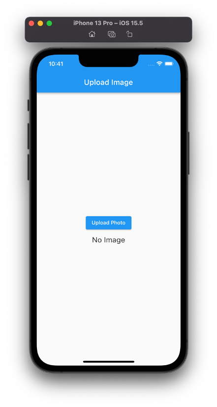
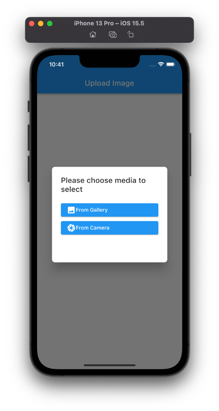
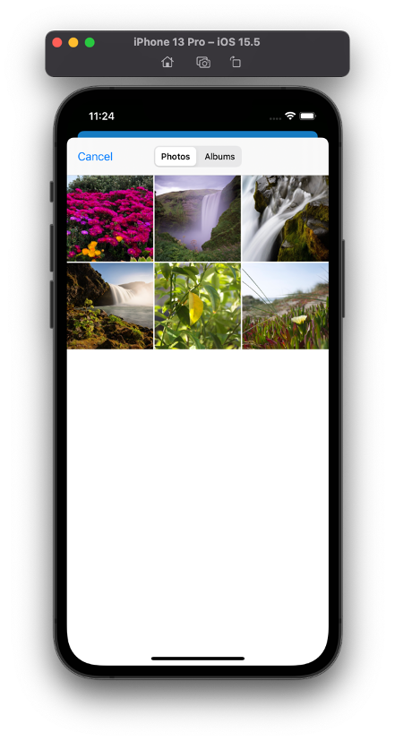
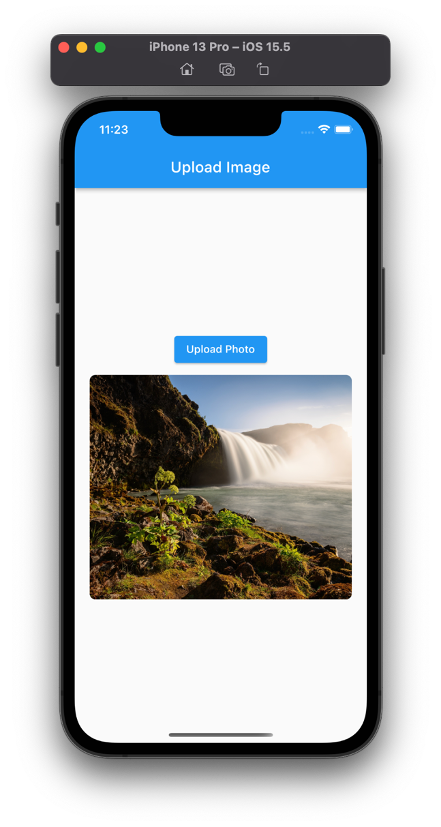
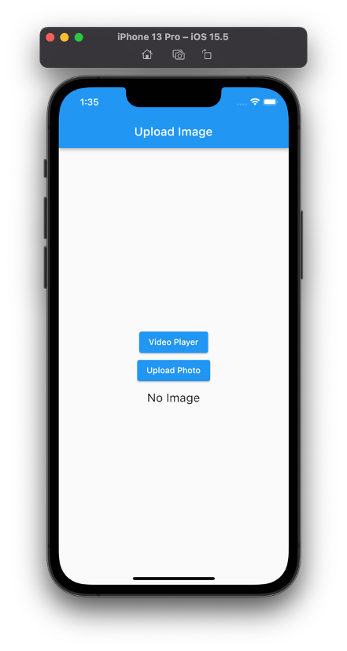
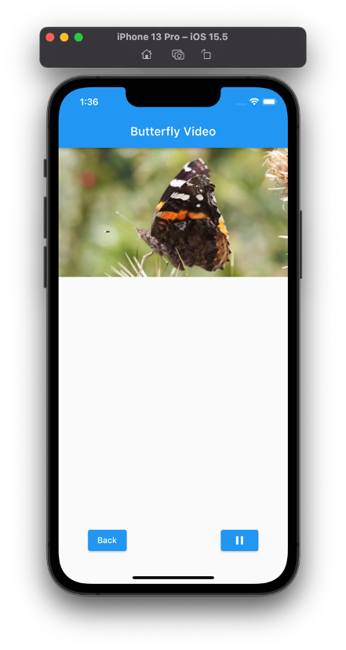

# Local Storage dan Video Player

## Hasil Praktikum 

### 1. File Upload 

  Melakukan upload file dan menampilkan pada aplikasi
  
  | Menekan Button Upload Foto | Memilih Media Upload|
  |-|-|
  |||
  
  | Mengakses Foto | Hasil Upload Foto |
  |-|-|
  |||
  
### 2. Video Player Plugin

  Menampilkan dan memainkan video pada aplikasi menggunakan plugin **video_player**.
  
  | Menekan Button Video Player | Klik Play Pada Video |
  |-|-|
  |||
